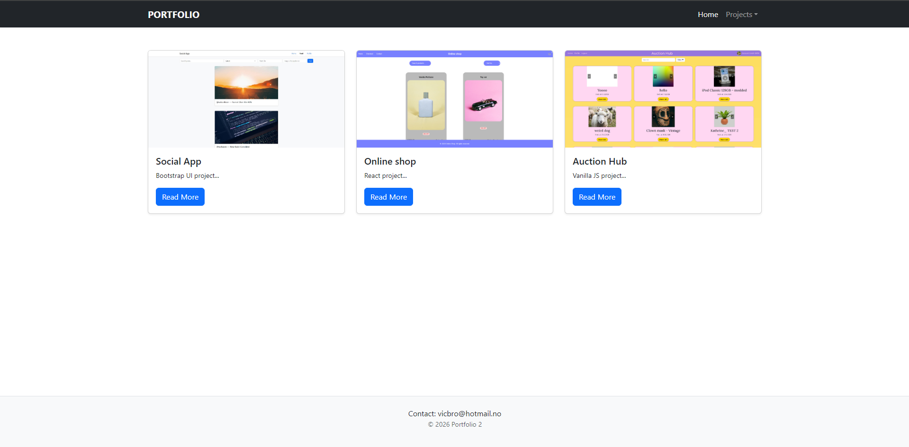

# Portfolio 2 | Victoria Brown

This is my second portfolio website that I have built using React to showcase some previous projects I have made.

## The project

Made a new portfolio website using React. The project includes:
- Use of React to showcase different projects.
- Responsive design and basic styling for the page.

## Improvements

- CSS Frameworks
- Javascript 1 Frameworks
- Semester Project 2

## Live demo
https://portfolio2victoriabrown.netlify.app/

## Installation and setup

Clone the repository
Run `npm install` to install dependencies
Run `npm start` to view the live project page